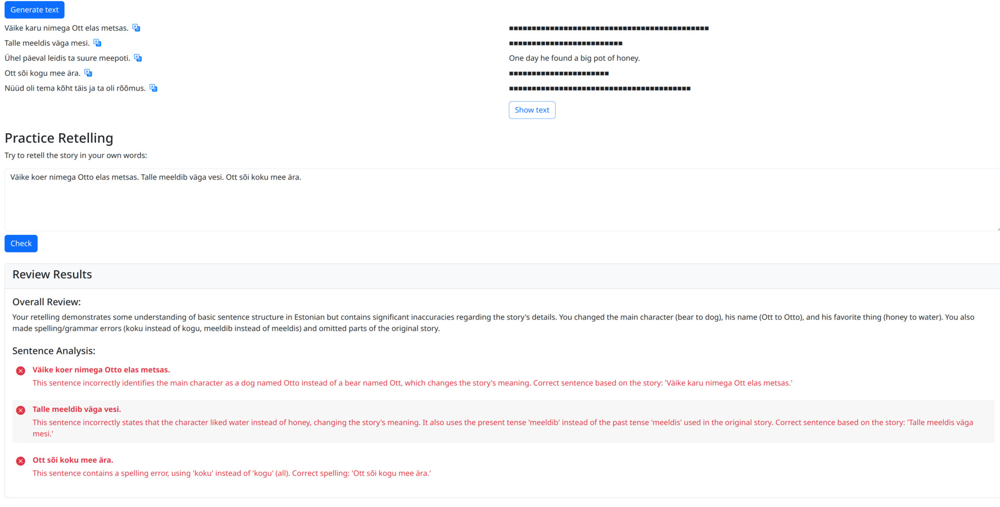

# Language Stories

A simple web application for language learning that uses Google's Generative AI (Gemini) to create stories in your target language and provide feedback on your retelling attempts.

[](images/lang-screen.jpg)

Try it [here](https://rankor.github.io/llm-lang-stories/)!

## Disclaimer

I'm not an Angular/TS developer, and this project was created for my own personal use within 1 day. The code may not follow best practices or be optimally structured.

## Privacy

**Important**: Your settings and API key are saved only in your browser's local storage and are not transferred or stored anywhere else. Your data stays on your device.

## How to Use

1. **Set Up**:
  - Enter your Gemini API key (get a free key from [Google AI Studio](https://aistudio.google.com/app/apikey))
  - Select the LLM model you want to use
  - Choose your learning language and native language

2. **Generate Content**:
  - Enter a topic or prompt in the text input field
  - Click "Generate text" to create a story in your learning language with translations

3. **Practice**:
  - Read the generated story in your learning language
  - Click on specific sentences to see their translations when needed
  - Use the retelling feature to practice writing or speaking in your learning language
  - Get AI-powered feedback on your retelling attempts

## Development

```bash
# Install dependencies
npm install

# Start development server
npm start

# Build for production
npm run build
```

## License

This project is licensed under the WTFPL - see [http://www.wtfpl.net/](http://www.wtfpl.net/) for details.
